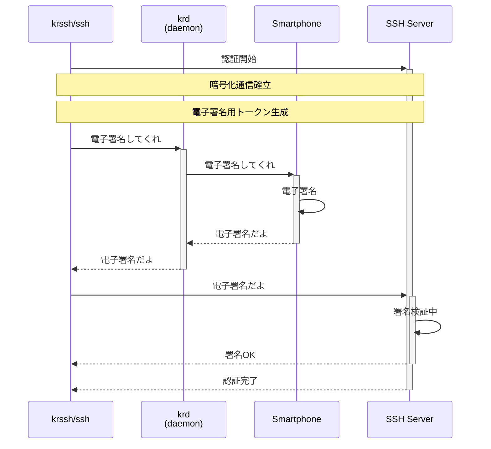
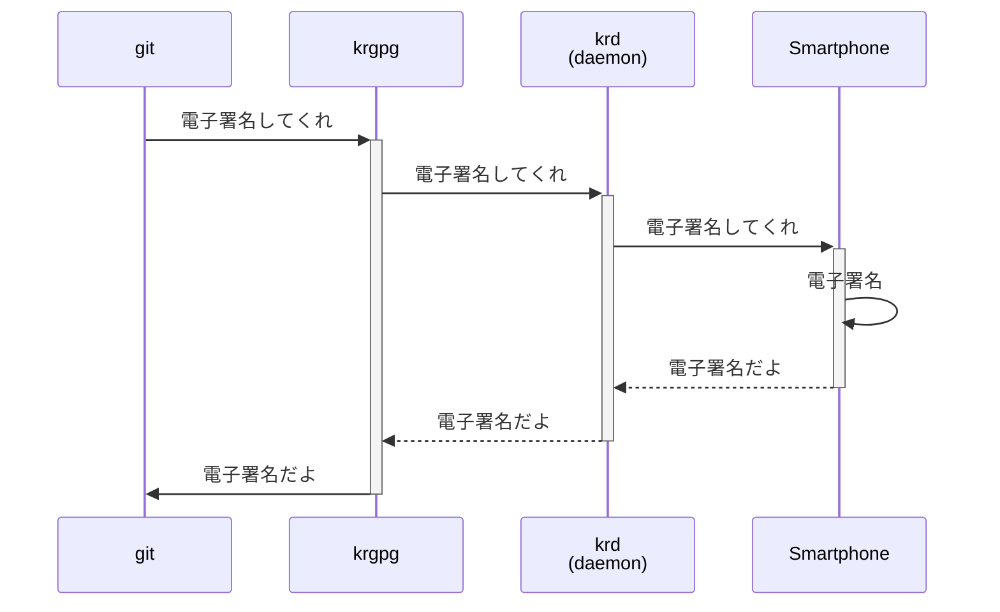

YubiKey のような暗号デバイスの代わりにスマホを使って FIDO U2F (Universal 2nd Factor) を実現できる製品があるというのは聞いたことがあったが，実は SSH の認証や git commit/tag 時の OpenPGP 電子署名も賄えるらしい。しかも Go 製でマルチプラットフォーム対応だってさ。

https://zenn.dev/nobonobo/articles/7c3e7582bbe67f

具体的な使い方については上の記事を見ていただきたいが，仕組みがイマイチ分からないんだよね。以下のシーケンス図でだいたい合ってる？ krssh と ssh の関係がねー。 krssh が全部を肩代わりしてるってことなのだろうか？

これで合っているという前提で話を進めるけど，ポイントはスマホは単なる鍵ストアではなく署名アプリケーションも兼ねているという点だろう。

Git commit/tag 時の OpenPGP 電子署名も似たような感じらしい，多分。

krgpg は電子署名に限れば gpg (GnuPG) と完全に置き換えるようだ。

Krypton のメリットは秘密鍵の管理がスマホ内で完全に閉じていて，かつ利用者は鍵に関してほぼノータッチでいられることだろう。暗号製品が忌避される理由のひとつは鍵管理の煩雑さにあると思うが， Krypton ではそうした煩わしさを可能な限り排除している。

ただし OpenPGP に関しては，本来的な利用をするのであれば何らかの形で鍵を証明する必要があるが，そうした機能はオミットされている。もっと言うなら鍵の有効期限や破棄に関してもユーザはコントロールできないようだ。

スマホを替えるときにどうやって鍵を継承するのかと思ったが，どうやらスマホごと破棄するらしい（笑） つまりスマホを買い換えたら鍵も一新して SSH サーバ等に登録し直す必要がある（SSH 等のサーバ情報は継承可能で，継承された情報を使って鍵の登録を半自動でやってくれるようだ）。

PKI の厳密な運用にあまり興味がなく「[こまけぇこたぁいいんだよ!!](https://dic.pixiv.net/a/%E3%81%93%E3%81%BE%E3%81%91%E3%81%87%E3%81%93%E3%81%9F%E3%81%81%E3%81%84%E3%81%84%E3%82%93%E3%81%A0%E3%82%88%21%21)」という方には Krypton は便利だし，セキュリティの観点からも安全と言っていいだろう（復号した秘密鍵を ssh-agent でキャッシュするよりは遥かにマシ）。一方で YubiKey などで既に厳密な運用をしている方が Krypton に乗り換えるメリットがあるかと言われれば「ちょっと...」という感じ。 [Kernel.org](https://www.kernel.org/doc/html/v5.8/process/maintainer-pgp-guide.html "Kernel Maintainer PGP guide — The Linux Kernel  documentation") みたいなところだとちょっとダメかもしれない。

まぁ，適材適所でいきましょう。道具は賢く使い分けるものです。

## 参考

https://krypt.co/developers/
https://github.com/kryptco
https://www.slideshare.net/AkiraMidouchi/krypton-for-devops
https://qiita.com/angel_p_57/items/2e3f3f8661de32a0d432
https://text.baldanders.info/remark/2020/09/authenticator-and-aal/
