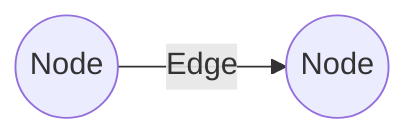
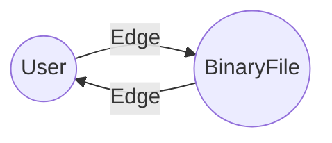
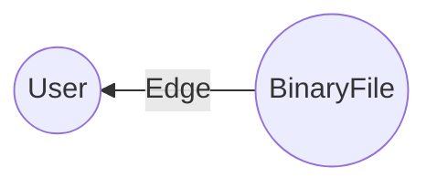

環境が整ったところでスキーマ定義について検証しておこう。確かこんなコードだったよね。

```go:ent/schema/user.go
package schema

import (
    "time"

    "entgo.io/ent"
    "entgo.io/ent/schema/edge"
    "entgo.io/ent/schema/field"
)

// User holds the schema definition for the User entity.
type User struct {
    ent.Schema
}

// Fields of the User.
func (User) Fields() []ent.Field {
    return []ent.Field{
        field.String("username").
            MaxLen(63).
            NotEmpty().
            Unique(),
        field.Time("created_at").
            Default(time.Now),
        field.Time("updated_at").
            Default(time.Now),
    }
}

// Edges of the User.
func (User) Edges() []ent.Edge {
    return []ent.Edge{
        edge.To("owned", BinaryFile.Type),
    }
}
```

```go:ent/schema/binaryfile.go
package schema

import (
    "time"

    "entgo.io/ent"
    "entgo.io/ent/schema/edge"
    "entgo.io/ent/schema/field"
)

// BinaryFile holds the schema definition for the BinaryFile entity.
type BinaryFile struct {
    ent.Schema
}

// Fields of the BinaryFile.
func (BinaryFile) Fields() []ent.Field {
    return []ent.Field{
        field.String("filename").
            NotEmpty().
            Unique(),
        field.Bytes("body").
            Optional().
            Nillable(),
        field.Time("created_at").
            Default(time.Now),
        field.Time("updated_at").
            Default(time.Now),
    }
}

// Edges of the BinaryFile.
func (BinaryFile) Edges() []ent.Edge {
    return []ent.Edge{
        edge.From("owner", User.Type).
            Unique().
            Required().
            Ref("owned"),
    }
}
```

## そもそも Edge ってなに？

知ってる方には言わずもながなだが，そもそも Edge ってなに？ って話から。



このように，データのグラフ構造を表すときの最小単位が節（node）と枝（edge）である。

上のコードに当てはめるなら



という関係を記述しているわけだ。具体的には From ノードでは To ノードに対して `owned` エッヂを定義し To ノードでは From ノードに対して `owner` エッヂを定義している。

ちなみに `owner` / `owned` といった Edges() 定義の名称は Fields() 定義の名称（`id` や `username` など）と同じにしてはいけないようで，同じ名前を使いまわすと entc generate コマンドでエラーになったり自動生成したコードがコンパイルエラーになったりした（最初は意味が分からなくてねぇ...）。

さらに BinaryFile 側の Edges() メソッドを見ると

```go:ent/schema/binaryfile.go
// Edges of the BinaryFile.
func (BinaryFile) Edges() []ent.Edge {
    return []ent.Edge{
        edge.From("owner", User.Type).
            Unique().
            Required().
            Ref("owned"),
    }
}
```

となっている。

Unique() オプション付与は `owner` エッヂの相手（From）ノードは唯一のレコードのみが紐づけられることを意味する。 `owned` エッヂには Unique() オプションはないので User (From) と BinaryFile (To) との関係（多重度）は one-to-many (O2M) であることが分かる。このように Unique() オプションを使って O2O, O2M, M2M の多重度を表現できる。

更に Ref() オプションを使ってエッヂ間の関係を記述でき，これを使って foreign key を定義できる。なお Ref() オプションは To 側ノードが From 側ノードへのエッヂ定義としてのみ書けるようだ。

スキーマ定義を確認するには以下のコマンドを叩くとよい。

```
$ go run -mod=mod entgo.io/ent/cmd/ent describe ./ent/schema
BinaryFile:
    +------------+-----------+--------+----------+----------+---------+---------------+-----------+-----------------------------+------------+
    |   Field    |   Type    | Unique | Optional | Nillable | Default | UpdateDefault | Immutable |          StructTag          | Validators |
    +------------+-----------+--------+----------+----------+---------+---------------+-----------+-----------------------------+------------+
    | id         | int       | false  | false    | false    | false   | false         | false     | json:"id,omitempty"         |          0 |
    | filename   | string    | true   | false    | false    | false   | false         | false     | json:"filename,omitempty"   |          1 |
    | body       | []byte    | false  | true     | true     | false   | false         | false     | json:"body,omitempty"       |          0 |
    | created_at | time.Time | false  | false    | false    | true    | false         | false     | json:"created_at,omitempty" |          0 |
    | updated_at | time.Time | false  | false    | false    | true    | false         | false     | json:"updated_at,omitempty" |          0 |
    +------------+-----------+--------+----------+----------+---------+---------------+-----------+-----------------------------+------------+
    +-------+------+---------+---------+----------+--------+----------+
    | Edge  | Type | Inverse | BackRef | Relation | Unique | Optional |
    +-------+------+---------+---------+----------+--------+----------+
    | owner | User | true    | owned   | M2O      | true   | true     |
    +-------+------+---------+---------+----------+--------+----------+

User:
    +------------+-----------+--------+----------+----------+---------+---------------+-----------+-----------------------------+------------+
    |   Field    |   Type    | Unique | Optional | Nillable | Default | UpdateDefault | Immutable |          StructTag          | Validators |
    +------------+-----------+--------+----------+----------+---------+---------------+-----------+-----------------------------+------------+
    | id         | int       | false  | false    | false    | false   | false         | false     | json:"id,omitempty"         |          0 |
    | username   | string    | true   | false    | false    | false   | false         | false     | json:"username,omitempty"   |          2 |
    | created_at | time.Time | false  | false    | false    | true    | false         | false     | json:"created_at,omitempty" |          0 |
    | updated_at | time.Time | false  | false    | false    | true    | false         | false     | json:"updated_at,omitempty" |          0 |
    +------------+-----------+--------+----------+----------+---------+---------------+-----------+-----------------------------+------------+
    +-------+------------+---------+---------+----------+--------+----------+
    | Edge  |    Type    | Inverse | BackRef | Relation | Unique | Optional |
    +-------+------------+---------+---------+----------+--------+----------+
    | owned | BinaryFile | false   |         | O2M      | false  | true     |
    +-------+------------+---------+---------+----------+--------+----------+
```

## スキーマ定義から DDL を生成する

[ent] ではスキーマ定義から DDL を生成することができる。この機能を使って意図通りのテーブル構成になるか確認しておこう。

```go:sample2.go
func Run() exitcode.ExitCode {
    // get ent context
    entCtx, err := dbconn.NewEnt()
    if err != nil {
        fmt.Fprintln(os.Stderr, err)
        return exitcode.Abnormal
    }
    defer entCtx.Close()

    // output DDL
    if err := entCtx.GetClient().Schema.WriteTo(context.TODO(), os.Stdout); err != nil {
        entCtx.GetLogger().Error().Interface("error", errs.Wrap(err)).Send()
        return exitcode.Abnormal
    }

    return exitcode.Normal
}
```

これを実行すると

```
$ go run sample2.go
BEGIN;
CREATE TABLE IF NOT EXISTS "binary_files"("id" bigint GENERATED BY DEFAULT AS IDENTITY NOT NULL, "filename" varchar UNIQUE NOT NULL, "body" bytea NULL, "created_at" timestamp with time zone NOT NULL, "updated_at" timestamp with time zone NOT NULL, "user_owned" bigint NULL, PRIMARY KEY("id"));
CREATE TABLE IF NOT EXISTS "users"("id" bigint GENERATED BY DEFAULT AS IDENTITY NOT NULL, "username" varchar UNIQUE NOT NULL, "created_at" timestamp with time zone NOT NULL, "updated_at" timestamp with time zone NOT NULL, PRIMARY KEY("id"));
ALTER TABLE "binary_files" ADD CONSTRAINT "binary_files_users_owned" FOREIGN KEY("user_owned") REFERENCES "users"("id") ON DELETE SET NULL;
COMMIT;
```

と出力される。分かりにくいな（笑） 適当に整形するか[^fmt1]。

[^fmt1]: 以前からネット上の SQL 文整形サービスは「[SQLフォーマッターFor WEB](https://atl2.net/webtool/sql%e3%83%95%e3%82%a9%e3%83%bc%e3%83%9e%e3%83%83%e3%82%bf%e3%83%bcfor-web/ "SQLフォーマッターFor WEB | ドットツールズ")」のお世話になっている。今回久しぶりに利用したよ。ありがとう。いいサービスです。

```sql
BEGIN
;
CREATE TABLE IF NOT EXISTS "binary_files"(
  "id" bigint GENERATED BY
    DEFAULT AS IDENTITY NOT NULL
    ,"filename" varchar UNIQUE NOT NULL
    ,"body" bytea NULL
    ,"created_at" timestamp with time zone NOT NULL
    ,"updated_at" timestamp with time zone NOT NULL
    ,"user_owned" bigint NULL
    ,PRIMARY KEY("id")
)
;
CREATE TABLE IF NOT EXISTS "users"(
  "id" bigint GENERATED BY
    DEFAULT AS IDENTITY NOT NULL
    ,"username" varchar UNIQUE NOT NULL
    ,"created_at" timestamp with time zone NOT NULL
    ,"updated_at" timestamp with time zone NOT NULL
    ,PRIMARY KEY("id")
)
;
ALTER TABLE "binary_files" ADD CONSTRAINT "binary_files_users_owned" FOREIGN KEY(
  "user_owned"
) REFERENCES "users"(
  "id"
)
ON  DELETE
SET
  NULL
;
COMMIT
;
```

### テーブル名を変更したい

[GORM] もそうだったが，やっぱテーブル名って複数形なんだな。これが普通って認識でいいのかな。

テーブル名を変更するには Annotations() メソッドを使うらしい。

```go
// Annotations of the User.
func (User) Annotations() []schema.Annotation {
    return []schema.Annotation{
        entsql.Annotation{Table: "Foo"},
    }
}
```

まぁ，今回はしないけどね。

### Validator は DDL に影響を与えない？

`users.username` フィールドには組み込み validator を使って MaxLen(63) と定義していたのだが， DDL を見ても `varchr(63)` とかにはしてくれないらしい。 DDL 上の型を明示的に変更したいなら SchemaType() を使って

```go
// Fields of the User.
func (User) Fields() []ent.Field {
    return []ent.Field{
        field.String("username").
            SchemaType(map[string]string{
                dialect.Postgres: "varchar(63)",
            }).
            NotEmpty().
            Unique(),
        ...
    }
}
```

とすればいいようだ。

### Primary Key の名前と型を変更したい

Primary Key としては暗黙的に int 型の `id` フィールドが定義され，それがそのままカラム名になっている。
`id` フィールドを上書き再定義することで DDL 上のカラム名と型を変更することができるようだ。

```go
// Fields of the User.
func (User) Fields() []ent.Field {
    return []ent.Field{
        field.String("id").
            StorageKey("user_id").
            StructTag(`json:"user_id"`).
            SchemaType(map[string]string{
                dialect.Postgres: "varchar(20)",
            }),
        ...
    }
}
```

これも今回はしない。

### 外部参照カラムは NOT NULL にできない？

Edges() メソッド定義で生成される外部参照カラム（今回なら `binary_files.user_owned`）は NOT NULL にできないっぽい。 Required() オプションは DDL に対しては効いてない感じ。元のレコードを削除するときの諸々の不都合を回避したいから？ なお，外部参照カラムを foreign key にしたくない場合は DDL 生成処理の中で WithForeignKeys() 関数を使って

```go
// output DDL
if err := entCtx.GetClient().Schema.WriteTo(context.TODO(), os.Stdout, , migrate.WithForeignKeys(false)); err != nil {
    entCtx.GetLogger().Error().Interface("error", errs.Wrap(err)).Send()
    return exitcode.Abnormal
}
```

とすればいいらしい。後述の Create() メソッドでも同様にできる。今回はしない。

### 外部参照カラム名を変えたいが...

今回の構成では変えられない。他所様のブログ等を見るに From/To を入れ替えて



という片方向の関連にすれば Field() オプションを使って Fields() メソッドで定義されたフィールド名に紐づけできるらしい。片方向は面白くないし，今回はそこまで名前に思い入れがあるわけではないので弄らないことにする。

### 再び DDL を生成する

ここまでのスキーマ定義は以下の通り

```go:ent/schema/user.go
package schema

import (
    "time"

    "entgo.io/ent"
    "entgo.io/ent/dialect"
    "entgo.io/ent/schema/edge"
    "entgo.io/ent/schema/field"
)

// User holds the schema definition for the User entity.
type User struct {
    ent.Schema
}

// Fields of the User.
func (User) Fields() []ent.Field {
    return []ent.Field{
        field.String("username").
            SchemaType(map[string]string{
                dialect.Postgres: "varchar(63)",
            }).
            NotEmpty().
            Unique(),
        field.Time("created_at").
            Default(time.Now),
        field.Time("updated_at").
            Default(time.Now),
    }
}

// Edges of the User.
func (User) Edges() []ent.Edge {
    return []ent.Edge{
        edge.To("owned", BinaryFile.Type),
    }
}
```

```go:ent/schema/binaryfile.go
package schema

import (
    "time"

    "entgo.io/ent"
    "entgo.io/ent/schema/edge"
    "entgo.io/ent/schema/field"
)

// BinaryFile holds the schema definition for the BinaryFile entity.
type BinaryFile struct {
    ent.Schema
}

// Fields of the BinaryFile.
func (BinaryFile) Fields() []ent.Field {
    return []ent.Field{
        field.String("filename").
            NotEmpty().
            Unique(),
        field.Bytes("body").
            Optional().
            Nillable(),
        field.Time("created_at").
            Default(time.Now),
        field.Time("updated_at").
            Default(time.Now),
    }
}

// Edges of the BinaryFile.
func (BinaryFile) Edges() []ent.Edge {
    return []ent.Edge{
        edge.From("owner", User.Type).
            Unique().
            Required().
            Ref("owned"),
    }
}
```

この状態で再び DDL を生成してみる。実行結果を整形したものだけ挙げておこう。

```sql
BEGIN
;
CREATE TABLE IF NOT EXISTS "binary_files"(
   "id" bigint GENERATED BY
     DEFAULT AS IDENTITY NOT NULL
    ,"filename" varchar UNIQUE NOT NULL
    ,"body" bytea NULL
    ,"created_at" timestamp with time zone NOT NULL
    ,"updated_at" timestamp with time zone NOT NULL
    ,"user_owned" bigint NULL
    ,PRIMARY KEY("id")
)
;
CREATE TABLE IF NOT EXISTS "users"(
   "id" bigint GENERATED BY
     DEFAULT AS IDENTITY NOT NULL
    ,"username" varchar(63) UNIQUE NOT NULL
    ,"created_at" timestamp with time zone NOT NULL
    ,"updated_at" timestamp with time zone NOT NULL
    ,PRIMARY KEY("id")
)
;
ALTER TABLE "binary_files" ADD CONSTRAINT "binary_files_users_owned" FOREIGN KEY(
  "user_owned"
) REFERENCES "users"(
  "id"
)
ON  DELETE
SET
  NULL
;
COMMIT
;
```

まぁ，こんなもんかな。

## テーブルの作成

では，いよいよテーブルを作成しよう。さきほどの sample2.go を少しいじって

```go:sample3.go
// create tables
if err := entCtx.GetClient().Schema.Create(context.TODO()); err != nil {
    entCtx.GetLogger().Error().Interface("error", errs.Wrap(err)).Send()
    return exitcode.Abnormal
}
```

とする。実行結果は以下の通り。

```
$ go run sample\sample3.go
0:00AM INF Dialing PostgreSQL server host=hostname module=pgx
0:00AM INF Exec args=[] commandTag=QkVHSU4= module=pgx pid=2629 sql=begin
0:00AM INF Query args=[] module=pgx pid=2629 rowCount=1 sql="SHOW server_version_num"
0:00AM INF Query args=["binary_files"] module=pgx pid=2629 rowCount=1 sql="SELECT COUNT(*) FROM \"information_schema\".\"tables\" WHERE \"table_schema\" = CURRENT_SCHEMA() AND \"table_name\" = $1"
0:00AM INF Exec args=[] commandTag=Q1JFQVRFIFRBQkxF module=pgx pid=2629 sql="CREATE TABLE IF NOT EXISTS \"binary_files\"(\"id\" bigint GENERATED BY DEFAULT AS IDENTITY NOT NULL, \"filename\" varchar UNIQUE NOT NULL, \"body\" bytea NULL, \"created_at\" timestamp with time zone NOT NULL, \"updated_at\" timestamp with time zone NOT NULL, \"user_owned\" bigint NULL, PRIMARY KEY(\"id\"))"
0:00AM INF Query args=["users"] module=pgx pid=2629 rowCount=1 sql="SELECT COUNT(*) FROM \"information_schema\".\"tables\" WHERE \"table_schema\" = CURRENT_SCHEMA() AND \"table_name\" = $1"
0:00AM INF Exec args=[] commandTag=Q1JFQVRFIFRBQkxF module=pgx pid=2629 sql="CREATE TABLE IF NOT EXISTS \"users\"(\"id\" bigint GENERATED BY DEFAULT AS IDENTITY NOT NULL, \"username\" varchar(63) UNIQUE NOT NULL, \"created_at\" timestamp with time zone NOT NULL, \"updated_at\" timestamp with time zone NOT NULL, PRIMARY KEY(\"id\"))"
0:00AM INF Query args=["FOREIGN KEY","binary_files_users_owned"] module=pgx pid=2629 rowCount=1 sql="SELECT COUNT(*) FROM \"information_schema\".\"table_constraints\" WHERE \"table_schema\" = CURRENT_SCHEMA() AND \"constraint_type\" = $1 AND \"constraint_name\" = $2"
0:00AM INF Exec args=[] commandTag=QUxURVIgVEFCTEU= module=pgx pid=2629 sql="ALTER TABLE \"binary_files\" ADD CONSTRAINT \"binary_files_users_owned\" FOREIGN KEY(\"user_owned\") REFERENCES \"users\"(\"id\") ON DELETE SET NULL"
0:00AM INF Exec args=[] commandTag=Q09NTUlU module=pgx pid=2629 sql=commit
0:00AM INF closed connection module=pgx pid=2629
```

ちゃんと作成されているようである。うんうん。

## 複数の Primary Key は設定できない（今のところ）

どうも primary key を複数定義することは出来ないようだ。この辺は以下の issue で議論されているようだが，まだ実装には至ってない。

https://github.com/ent/ent/issues/400
https://github.com/ent/ent/issues/1949

私はこの時点で [ent] の採用を泣く泣く見送った。よくできてると思うんだけどなぁ。

## ent はテーブルの Drop はできない？

ひょっとして [ent] ってテーブルの Drop 機能はないのかな。カラムやインデックスは Drop できるみたいだけど。特に開発初期は頻繁にテーブルを作ったり潰したりするので割と必須の機能だと思うんだけど，最近はそういうやり方はしない？ まぁ，最悪は SQL 文を投げればいいんだけど。でもそのためだけに素の [sql][database/sql].DB に触れるようにするのは何か違う気がするし...

[ent]: https://entgo.io/
[GORM]: https://gorm.io/ "GORM - The fantastic ORM library for Golang, aims to be developer friendly."
[PostgreSQL]: https://www.postgresql.org/ "PostgreSQL: The world's most advanced open source database"
[Go]: https://go.dev/
[github.com/ent/ent]: https://github.com/ent/ent "ent/ent: An entity framework for Go"
[database/sql]: https://pkg.go.dev/database/sql "sql package - database/sql - pkg.go.dev"
[github.com/jackc/pgx]: https://github.com/jackc/pgx "jackc/pgx: PostgreSQL driver and toolkit for Go"
[github.com/rs/zerolog]: https://github.com/rs/zerolog "rs/zerolog: Zero Allocation JSON Logger"
[a8m/enter]: https://github.com/a8m/enter "a8m/enter: A CLI for generating ER diagrams for Ent schema"
[mermaid.js]: https://mermaid-js.github.io/mermaid/ "mermaid - Markdownish syntax for generating flowcharts, sequence diagrams, class diagrams, gantt charts and git graphs."
