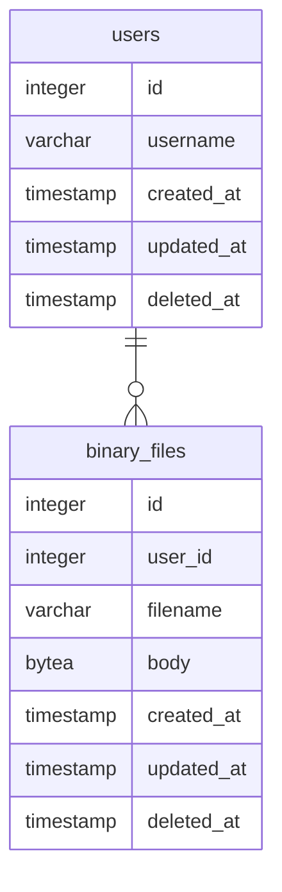

今回は以下の関係を持つ2つのテーブルを作って基本的な CRUD (Create/Read/Update/Delete) を試してみることにする。

[Go]: https://go.dev/
[PostgreSQL]: https://www.postgresql.org/ "PostgreSQL: The world's most advanced open source database"
[database/sql]: https://pkg.go.dev/database/sql "sql package - database/sql - pkg.go.dev"
[GORM]: https://gorm.io/ "GORM - The fantastic ORM library for Golang, aims to be developer friendly."
[github.com/simukti/sqldb-logger]: https://github.com/simukti/sqldb-logger "simukti/sqldb-logger: A logger for Go SQL database driver without modifying existing *sql.DB stdlib usage."
