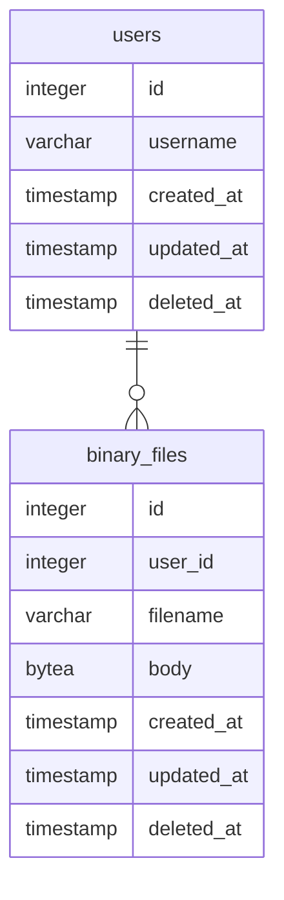

この節から以下の関係を持つ2つのテーブルを作って基本的な CRUD (Create/Read/Update/Delete) を試してみることにする。まずは MVC (Model-View-Controller) で言うところの Model の定義から。



大方の [Go] 製 ORM と同じく [GORM] でも Model 定義は構造体を使う。今回であればこんな感じでどうだろう。

```go
package model

import "gorm.io/gorm"

type User struct {
    gorm.Model
    Username    string
    BinaryFiles []BinaryFile // has many (0..N)
}

type BinaryFile struct {
    gorm.Model
    UserId   uint
    Filename string
    Body     []byte
}
```

ちなみに [gorm][GORM].Model は以下のように定義され，埋め込みフィールドとして機能する。

```go:go-gorm/gorm/model.go
package gorm

import "time"

// Model a basic GoLang struct which includes the following fields: ID, CreatedAt, UpdatedAt, DeletedAt
// It may be embedded into your model or you may build your own model without it
//    type User struct {
//      gorm.Model
//    }
type Model struct {
    ID        uint `gorm:"primarykey"`
    CreatedAt time.Time
    UpdatedAt time.Time
    DeletedAt DeletedAt `gorm:"index"`
}
```

つまり [gorm][GORM].Model を埋め込めば ID, CreatedAt, UpdatedAt, DeletedAt が自動的に定義される[^sd1]。もちろん [gorm][GORM].Model を使わずに Model 定義することも可能。

[^sd1]: DeletedAt の基底型は [sql][database/sql].NullTime (nullable な *time.Time 型) で，論理削除のフラグとして使うフィールドである。

これらの構造体を使って，まずは Migration からやってみる。 [GORM] では [gorm][GORM].DB.AutoMigrate() メソッドを使うのだが，いきなりはちょっと怖いので dry run でどうなるか試してみよう。

```go:sample3.go
import (
	"fmt"
	"os"
	"sample/gorm/model"
	"sample/orm"

	"github.com/spiegel-im-spiegel/errs"
	"github.com/spiegel-im-spiegel/gocli/exitcode"
	"gorm.io/gorm"
)

func Run() exitcode.ExitCode {
	// create gorm.DB instance for PostgreSQL service
	gormCtx, err := orm.NewGORM()
	if err != nil {
		fmt.Fprintln(os.Stderr, err)
		return exitcode.Abnormal
	}
	defer gormCtx.Close()

	// migration (dry run)
	if err := gormCtx.GetDb().Session(&gorm.Session{DryRun: true}).AutoMigrate(&model.User{}, &model.BinaryFile{}); err != nil {
		gormCtx.GetLogger().Error().Interface("error", errs.Wrap(err)).Send()
		return exitcode.Abnormal
	}

	return exitcode.Normal
}
```

で，動かしてみたら

```
dry run mode unsupported; dry run mode unsupported
```

とか言われた， [GORM] のエラーログで（しかも2回もw）。 Migration では dry run は対応しとらんのかーい！ しょうがない

```go:sample3b.go
// migration
if err := gormCtx.GetDb().WithContext(context.TODO()).AutoMigrate(&model.User{}, &model.BinaryFile{}); err != nil {
	gormCtx.GetLogger().Error().Interface("error", errs.Wrap(err)).Send()
	return exitcode.Abnormal
}
```

で，うーやーたー！と実行しよう。

実行結果のログを見ると

```
$ go run sample3b.go 
8:06PM INF Dialing PostgreSQL server host=hostname module=pgx
8:06PM INF Exec args=[] commandTag=null module=pgx pid=5178 sql=;
8:06PM INF Query args=["users","BASE TABLE"] module=pgx pid=5178 rowCount=1 sql="SELECT count(*) FROM information_schema.tables WHERE table_schema = CURRENT_SCHEMA() AND table_name = $1 AND table_type = $2"
8:06PM INF Exec args=[] commandTag=Q1JFQVRFIFRBQkxF module=pgx pid=5178 sql="CREATE TABLE \"users\" (\"id\" bigserial,\"created_at\" timestamptz,\"updated_at\" timestamptz,\"deleted_at\" timestamptz,\"username\" text,PRIMARY KEY (\"id\"))"
8:06PM INF Exec args=[] commandTag=Q1JFQVRFIElOREVY module=pgx pid=5178 sql="CREATE INDEX \"idx_users_deleted_at\" ON \"users\" (\"deleted_at\")"
8:06PM INF Query args=["binary_files","BASE TABLE"] module=pgx pid=5178 rowCount=1 sql="SELECT count(*) FROM information_schema.tables WHERE table_schema = CURRENT_SCHEMA() AND table_name = $1 AND table_type = $2"
8:06PM INF Exec args=[] commandTag=Q1JFQVRFIFRBQkxF module=pgx pid=5178 sql="CREATE TABLE \"binary_files\" (\"id\" bigserial,\"created_at\" timestamptz,\"updated_at\" timestamptz,\"deleted_at\" timestamptz,\"user_id\" bigint,\"filename\" text,\"body\" bytea,PRIMARY KEY (\"id\"),CONSTRAINT \"fk_users_binary_files\" FOREIGN KEY (\"user_id\") REFERENCES \"users\"(\"id\"))"
8:06PM INF Exec args=[] commandTag=Q1JFQVRFIElOREVY module=pgx pid=5178 sql="CREATE INDEX \"idx_binary_files_deleted_at\" ON \"binary_files\" (\"deleted_at\")"
8:06PM INF closed connection module=pgx pid=5178
```

となっていた。特徴を挙げると

1. テーブル名が複数形（`users`, `binary_files`）になっている
2. 2つのテーブルとも `id` が bigserial 型で定義されている
3. `users.username` および `binary_files.filename` が text 型で定義されている
4. `binary_files.user_id` が `users.id` の foreign key として定義されている

といった辺りだろうか。

テーブル名が複数形になる点は注意が必要だろう。強制的にテーブル名を指定したいなら

```go
func (m *User) TableName() string {
	return "m_user"
}
```

といった感じに TableName() メソッドを追加するとよい（今回はしない）。

`users.username` と `binary_files.filename` が text 型なのはサイズを指定しなかった私のミスだが，ファイル名はサイズ制限しないほうがいいか。あと両者を not null にしないとな。

というわけで，以下のように書き直してみた[^id1]。

[^id1]: 本当は `id` を uuid 型にしたいのだが，ちょっと面倒そうな感じ（[PostgreSQL] に extension を入れる必要あり？）なので，今回はパスした。

```go
package model

import "gorm.io/gorm"

type User struct {
	gorm.Model
	Username    string       `gorm:"size:63;not null"`
	BinaryFiles []BinaryFile // has many (0..N)
}

type BinaryFile struct {
	gorm.Model
	UserId   uint   `gorm:"not null"`
	Filename string `gorm:"not null"`
	Body     []byte
}
```

これでもう一度テーブルを生成してみる。その前にさっき作ったテーブルは手動で drop しておく。 [GORM] の Migration はテーブル定義の変更もできるそうだが，今回はその辺の検証は割愛する（イチから作り直したほうが早い）。

```
$ go run sample3b.go 
10:43PM INF Dialing PostgreSQL server host=hostname module=pgx
10:43PM INF Exec args=[] commandTag=null module=pgx pid=8947 sql=;
10:43PM INF Query args=["users","BASE TABLE"] module=pgx pid=8947 rowCount=1 sql="SELECT count(*) FROM information_schema.tables WHERE table_schema = CURRENT_SCHEMA() AND table_name = $1 AND table_type = $2"
10:43PM INF Exec args=[] commandTag=Q1JFQVRFIFRBQkxF module=pgx pid=8947 sql="CREATE TABLE \"users\" (\"id\" bigserial,\"created_at\" timestamptz,\"updated_at\" timestamptz,\"deleted_at\" timestamptz,\"username\" varchar(63) NOT NULL,PRIMARY KEY (\"id\"))"
10:43PM INF Exec args=[] commandTag=Q1JFQVRFIElOREVY module=pgx pid=8947 sql="CREATE INDEX \"idx_users_deleted_at\" ON \"users\" (\"deleted_at\")"
10:43PM INF Query args=["binary_files","BASE TABLE"] module=pgx pid=8947 rowCount=1 sql="SELECT count(*) FROM information_schema.tables WHERE table_schema = CURRENT_SCHEMA() AND table_name = $1 AND table_type = $2"
10:43PM INF Exec args=[] commandTag=Q1JFQVRFIFRBQkxF module=pgx pid=8947 sql="CREATE TABLE \"binary_files\" (\"id\" bigserial,\"created_at\" timestamptz,\"updated_at\" timestamptz,\"deleted_at\" timestamptz,\"user_id\" bigint NOT NULL,\"filename\" text NOT NULL,\"body\" bytea,PRIMARY KEY (\"id\"),CONSTRAINT \"fk_users_binary_files\" FOREIGN KEY (\"user_id\") REFERENCES \"users\"(\"id\"))"
10:43PM INF Exec args=[] commandTag=Q1JFQVRFIElOREVY module=pgx pid=8947 sql="CREATE INDEX \"idx_binary_files_deleted_at\" ON \"binary_files\" (\"deleted_at\")"
10:43PM INF closed connection module=pgx pid=8947
```

よーし，うむうむ，よーし。

他に struct タグで使える属性としては

| Tag Name                             | Sample Code                                                   |
| ------------------------------------ | ------------------------------------------------------------- |
| `column`                             | \``gorm:"column:column_name"`\`                               |
| `type`<br>`primary_key`<br>`default` | \``gorm:"type:uuid;primary_key;default:uuid_generate_v4()"`\` |
| `unique`                             | \``gorm:"unique"`\`                                           |
| `autoIncrement`                      | \``gorm:"autoIncrement"`\`                                    |
| `index`                              | \``gorm:"index"`\`<br>\``gorm:"index:idx_name"`\`             |
| `uniqueIndex`                        | \``gorm:"uniqueIndex"`\`                                      |

といったものがある。また，以下のサイトは DDL から [GORM] の Model 構造体に変換してくれる。なかなかよさげである。

https://sql2gorm.mccode.info/
https://github.com/cascax/sql2gorm

[Go]: https://go.dev/
[PostgreSQL]: https://www.postgresql.org/ "PostgreSQL: The world's most advanced open source database"
[database/sql]: https://pkg.go.dev/database/sql "sql package - database/sql - pkg.go.dev"
[GORM]: https://gorm.io/ "GORM - The fantastic ORM library for Golang, aims to be developer friendly."
[github.com/jackc/pgx]: https://github.com/jackc/pgx "jackc/pgx: PostgreSQL driver and toolkit for Go"
