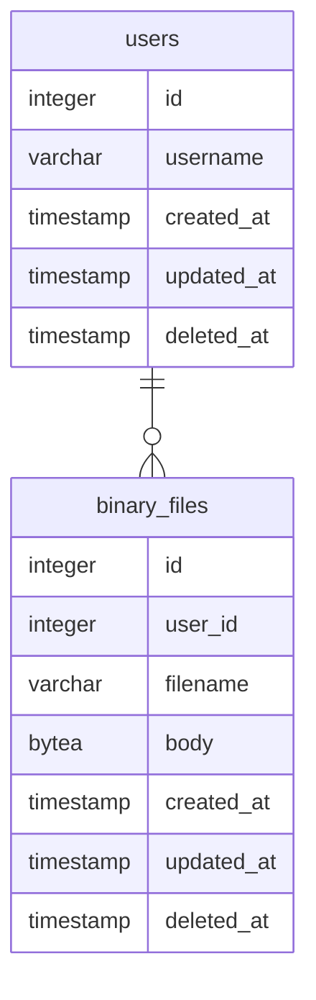

今回は以下の関係を持つ2つのテーブルを作って基本的な CRUD (Create/Read/Update/Delete) を試してみることにする。



早速 MVC (Model-View-Controller) で言うところの Model を定義していこう。大方の [Go] 製 ORM と同じく [GORM] でも Model 定義は構造体を使う。今回であればこんな感じでどうだろう。

```go
package model

import "gorm.io/gorm"

type User struct {
	gorm.Model
	Username    string
	BinaryFiles []BinaryFile
}

type BinaryFile struct {
	gorm.Model
	UserId   string
	Filename string
	Body     []byte
}
```

ちなみに [gorm][GORM].Model は以下のように定義され，埋め込みフィールドとして機能する。

```go:go-gorm/gorm/model.go
package gorm

import "time"

// Model a basic GoLang struct which includes the following fields: ID, CreatedAt, UpdatedAt, DeletedAt
// It may be embedded into your model or you may build your own model without it
//    type User struct {
//      gorm.Model
//    }
type Model struct {
	ID        uint `gorm:"primarykey"`
	CreatedAt time.Time
	UpdatedAt time.Time
	DeletedAt DeletedAt `gorm:"index"`
}
```

つまり [gorm][GORM].Model を埋め込めば ID, CreatedAt, UpdatedAt, DeletedAt が自動的に定義される。もちろん [gorm][GORM].Model を使わずに Model 定義することも可能。


[Go]: https://go.dev/
[PostgreSQL]: https://www.postgresql.org/ "PostgreSQL: The world's most advanced open source database"
[database/sql]: https://pkg.go.dev/database/sql "sql package - database/sql - pkg.go.dev"
[GORM]: https://gorm.io/ "GORM - The fantastic ORM library for Golang, aims to be developer friendly."
[github.com/simukti/sqldb-logger]: https://github.com/simukti/sqldb-logger "simukti/sqldb-logger: A logger for Go SQL database driver without modifying existing *sql.DB stdlib usage."
