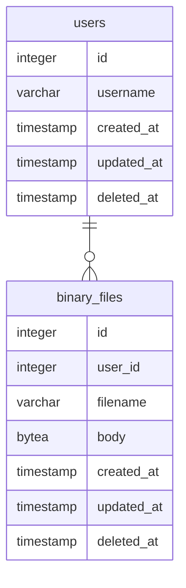

この節から以下の関係を持つ2つのテーブルを作ってデータの読み書きを試してみることにする。



まずは MVC (Model-View-Controller) で言うところの Model の定義から。大方の [Go] 製 ORM と同じく [GORM] でも Model 定義は構造体を使う。今回であればこんな感じでどうだろう。

```go:orm/model/user.go
package model

import "gorm.io/gorm"

type User struct {
    gorm.Model
    Username    string
    BinaryFiles []BinaryFile // has many (0..N)
}
```

```go:orm/model/binary-files.go
package model

import "gorm.io/gorm"

type BinaryFile struct {
    gorm.Model
    UserId   string
    Filename string
    Body     []byte
}
```

ちなみに [gorm][GORM].Model は以下のように定義され，埋め込みフィールドとして機能する。

```go:go-gorm/gorm/model.go
package gorm

import "time"

// Model a basic GoLang struct which includes the following fields: ID, CreatedAt, UpdatedAt, DeletedAt
// It may be embedded into your model or you may build your own model without it
//    type User struct {
//      gorm.Model
//    }
type Model struct {
    ID        uint `gorm:"primarykey"`
    CreatedAt time.Time
    UpdatedAt time.Time
    DeletedAt DeletedAt `gorm:"index"`
}
```

つまり [gorm][GORM].Model を埋め込めば ID, CreatedAt, UpdatedAt, DeletedAt が自動的に定義される[^sd1]。もちろん [gorm][GORM].Model を使わずに Model 定義することも可能。

[^sd1]: DeletedAt の基底型は [sql][database/sql].NullTime (nullable な *time.Time 型) で，論理削除のフラグとして使うフィールドである。

これらの構造体を使って，まずは Migration からやってみる。 [GORM] では [gorm][GORM].DB.AutoMigrate() メソッドを使うのだが，いきなりはちょっと怖いので dry run でどうなるか試してみよう。

```go:sample3.go
import (
    "fmt"
    "os"
    "sample/orm"
    "sample/orm/model"

    "github.com/spiegel-im-spiegel/errs"
    "github.com/spiegel-im-spiegel/gocli/exitcode"
    "gorm.io/gorm"
)

func Run() exitcode.ExitCode {
    // create gorm.DB instance for PostgreSQL service
    gormCtx, err := orm.NewGORM()
    if err != nil {
        fmt.Fprintln(os.Stderr, err)
        return exitcode.Abnormal
    }
    defer gormCtx.Close()

    // migration (dry run)
    if err := gormCtx.GetDb().Session(&gorm.Session{DryRun: true}).AutoMigrate(&model.User{}, &model.BinaryFile{}); err != nil {
        gormCtx.GetLogger().Error().Interface("error", errs.Wrap(err)).Send()
        return exitcode.Abnormal
    }

    return exitcode.Normal
}
```

で，動かしてみたら

```
dry run mode unsupported; dry run mode unsupported
```

とか言われた， [GORM] のエラーログで（しかも2回もw）。 [gorm][GORM].DB.AutoMigrate() メソッドでは dry run は対応しとらんのかーい！ しょうがない

```go:sample3b.go
// migration
if err := gormCtx.GetDb().WithContext(context.TODO()).AutoMigrate(&model.User{}, &model.BinaryFile{}); err != nil {
    gormCtx.GetLogger().Error().Interface("error", errs.Wrap(err)).Send()
    return exitcode.Abnormal
}
```

で，うーやーたー！と実行しよう（最悪は手動でどうにかする）。

実行結果のログを見ると

```
$ go run sample3b.go 
0:00AM INF Dialing PostgreSQL server host=hostname module=pgx
0:00AM INF Exec args=[] commandTag=null module=pgx pid=5178 sql=;
0:00AM INF Query args=["users","BASE TABLE"] module=pgx pid=5178 rowCount=1 sql="SELECT count(*) FROM information_schema.tables WHERE table_schema = CURRENT_SCHEMA() AND table_name = $1 AND table_type = $2"
0:00AM INF Exec args=[] commandTag=Q1JFQVRFIFRBQkxF module=pgx pid=5178 sql="CREATE TABLE \"users\" (\"id\" bigserial,\"created_at\" timestamptz,\"updated_at\" timestamptz,\"deleted_at\" timestamptz,\"username\" text,PRIMARY KEY (\"id\"))"
0:00AM INF Exec args=[] commandTag=Q1JFQVRFIElOREVY module=pgx pid=5178 sql="CREATE INDEX \"idx_users_deleted_at\" ON \"users\" (\"deleted_at\")"
0:00AM INF Query args=["binary_files","BASE TABLE"] module=pgx pid=5178 rowCount=1 sql="SELECT count(*) FROM information_schema.tables WHERE table_schema = CURRENT_SCHEMA() AND table_name = $1 AND table_type = $2"
0:00AM INF Exec args=[] commandTag=Q1JFQVRFIFRBQkxF module=pgx pid=5178 sql="CREATE TABLE \"binary_files\" (\"id\" bigserial,\"created_at\" timestamptz,\"updated_at\" timestamptz,\"deleted_at\" timestamptz,\"user_id\" bigint,\"filename\" text,\"body\" bytea,PRIMARY KEY (\"id\"),CONSTRAINT \"fk_users_binary_files\" FOREIGN KEY (\"user_id\") REFERENCES \"users\"(\"id\"))"
0:00AM INF Exec args=[] commandTag=Q1JFQVRFIElOREVY module=pgx pid=5178 sql="CREATE INDEX \"idx_binary_files_deleted_at\" ON \"binary_files\" (\"deleted_at\")"
0:00AM INF closed connection module=pgx pid=5178
```

となっていた。特徴を挙げると

1. テーブル名が複数形（`users`, `binary_files`）になっている
2. 2つのテーブルとも `id` が bigserial 型で定義されている
3. `binary_files.user_id` が `users.id` の foreign key として定義されている
4. `users.username` および `binary_files.filename` が text 型で定義されている

といった辺りだろうか。

テーブル名が複数形になる点は注意が必要だろう。強制的にテーブル名を指定したいなら

```go
func (m *User) TableName() string {
    return "m_user"
}
```

といった感じに TableName() メソッドを追加するとよい（今回はしない）。

本当なら `id` カラムは serial/bigserial ではなく uuid とかにしたいよね。その場合は

```go
type User struct {
    ID string `validate:"is_valid_uuid" gorm:"primaryKey;size:255;default:uuid_generate_v4()"`
    ...
}
```

とかに[すべき](https://qiita.com/taisuke-j/items/aa38198cb9ff88836aab "GORMでマイグレーションする際の覚書 - Qiita")なんだろうけど，この場合は [PostgreSQL] 側も EXTENSION などの設定をしないといけないので，今回は見なかったことにする（笑）

自動で foreign key を付けて欲しくない場合は，データベース接続時のオプションで

```go
db, err := gorm.Open(postgres.New(postgres.Config{
    Conn: stdlib.OpenDB(*cfg),
}), &gorm.Config{
    DisableForeignKeyConstraintWhenMigrating: true,
})
```

と指定すればいいらしいが，これも今回は試さない。

`users.username` と `binary_files.filename` が text 型なのはサイズを指定しなかった私のミスだが，ファイル名はサイズ制限しないほうがいいか。あと両者を not null かつ unique にしないとな。

以上を踏まえて，以下のように書き直してみた。

```go:orm/model/user.go
package model

import "gorm.io/gorm"

type User struct {
    gorm.Model
    Username    string       `gorm:"size:63;unique;not null"`
    BinaryFiles []BinaryFile // has many (0..N)
}
```

```go:orm/model/binary-files.go
package model

import "gorm.io/gorm"

type BinaryFile struct {
    gorm.Model
    UserId   uint   `gorm:"not null"`
    Filename string `gorm:"unique;not null"`
    Body     []byte
}
```


これでもう一度テーブルを生成してみる。その前にさっき作ったテーブルは手動で DROP しておく。 [gorm][GORM].DB.AutoMigrate() メソッドはテーブル定義の変更もできるが（ただし安全面を考慮してカラムの削除はしない），今回はその辺の検証は割愛する（最初だし）。

```
$ go run sample3b.go 
0:00AM INF Dialing PostgreSQL server host=hostname module=pgx
0:00AM INF Exec args=[] commandTag=null module=pgx pid=8193 sql=;
0:00AM INF Query args=["users","BASE TABLE"] module=pgx pid=8193 rowCount=1 sql="SELECT count(*) FROM information_schema.tables WHERE table_schema = CURRENT_SCHEMA() AND table_name = $1 AND table_type = $2"
0:00AM INF Exec args=[] commandTag=Q1JFQVRFIFRBQkxF module=pgx pid=8193 sql="CREATE TABLE \"users\" (\"id\" bigserial,\"created_at\" timestamptz,\"updated_at\" timestamptz,\"deleted_at\" timestamptz,\"username\" varchar(63) NOT NULL UNIQUE,PRIMARY KEY (\"id\"))"
0:00AM INF Exec args=[] commandTag=Q1JFQVRFIElOREVY module=pgx pid=8193 sql="CREATE INDEX \"idx_users_deleted_at\" ON \"users\" (\"deleted_at\")"
0:00AM INF Query args=["binary_files","BASE TABLE"] module=pgx pid=8193 rowCount=1 sql="SELECT count(*) FROM information_schema.tables WHERE table_schema = CURRENT_SCHEMA() AND table_name = $1 AND table_type = $2"
0:00AM INF Exec args=[] commandTag=Q1JFQVRFIFRBQkxF module=pgx pid=8193 sql="CREATE TABLE \"binary_files\" (\"id\" bigserial,\"created_at\" timestamptz,\"updated_at\" timestamptz,\"deleted_at\" timestamptz,\"user_id\" bigint NOT NULL,\"filename\" text NOT NULL UNIQUE,\"body\" bytea,PRIMARY KEY (\"id\"),CONSTRAINT \"fk_users_binary_files\" FOREIGN KEY (\"user_id\") REFERENCES \"users\"(\"id\"))"
0:00AM INF Exec args=[] commandTag=Q1JFQVRFIElOREVY module=pgx pid=8193 sql="CREATE INDEX \"idx_binary_files_deleted_at\" ON \"binary_files\" (\"deleted_at\")"
0:00AM INF closed connection module=pgx pid=8193
```

よーし，うむうむ，よーし。

他に struct タグで使える属性としては

| Tag Name                             | Sample Code                                                   |
| ------------------------------------ | ------------------------------------------------------------- |
| `column`                             | \``gorm:"column:column_name"`\`                               |
| `autoIncrement`                      | \``gorm:"autoIncrement"`\`                                    |
| `index`                              | \``gorm:"index"`\`<br>\``gorm:"index:idx_name"`\`             |
| `uniqueIndex`                        | \``gorm:"uniqueIndex"`\`                                      |

といったものがある。また，以下のサイトは DDL から [GORM] の Model 構造体に変換してくれる。なかなかよさげである。

https://sql2gorm.mccode.info/
https://github.com/cascax/sql2gorm

[GORM] では Migrator というインタフェースが用意されていて，これを使ってテーブル生成・変更・削除に関する機能をサービス横断的に提供されている。ただし DBMS によっては全ての機能を提供していない場合もある。

```go:go-gorm/gorm/migrator.go
type Migrator interface {
    // AutoMigrate
    AutoMigrate(dst ...interface{}) error

    // Database
    CurrentDatabase() string
    FullDataTypeOf(*schema.Field) clause.Expr

    // Tables
    CreateTable(dst ...interface{}) error
    DropTable(dst ...interface{}) error
    HasTable(dst interface{}) bool
    RenameTable(oldName, newName interface{}) error

    // Columns
    AddColumn(dst interface{}, field string) error
    DropColumn(dst interface{}, field string) error
    AlterColumn(dst interface{}, field string) error
    MigrateColumn(dst interface{}, field *schema.Field, columnType ColumnType) error
    HasColumn(dst interface{}, field string) bool
    RenameColumn(dst interface{}, oldName, field string) error
    ColumnTypes(dst interface{}) ([]ColumnType, error)

    // Views
    CreateView(name string, option ViewOption) error
    DropView(name string) error

    // Constraints
    CreateConstraint(dst interface{}, name string) error
    DropConstraint(dst interface{}, name string) error
    HasConstraint(dst interface{}, name string) bool

    // Indexes
    CreateIndex(dst interface{}, name string) error
    DropIndex(dst interface{}, name string) error
    HasIndex(dst interface{}, name string) bool
    RenameIndex(dst interface{}, oldName, newName string) error
}
```

たとえばテーブルの DROP は

```go:sample4.go
if err := gormCtx.GetDb().Migrator().DropTable(&model.User{}, &model.BinaryFile{}); err != nil {
    gormCtx.GetLogger().Error().Interface("error", errs.Wrap(err)).Send()
    return exitcode.Abnormal
}
```

みたいな感じで書ける。これを実際に実行すると

```
$ go run sample4.go 
0:00AM INF Dialing PostgreSQL server host=hostname module=pgx
0:00AM INF Exec args=[] commandTag=null module=pgx pid=4565 sql=;
0:00AM INF Exec args=[] commandTag=RFJPUCBUQUJMRQ== module=pgx pid=4565 sql="DROP TABLE IF EXISTS \"binary_files\" CASCADE"
0:00AM INF Exec args=[] commandTag=RFJPUCBUQUJMRQ== module=pgx pid=4565 sql="DROP TABLE IF EXISTS \"users\" CASCADE"
0:00AM INF closed connection module=pgx pid=4565
```

などとテーブル間の関係（foreign key のあたり）をちゃんと認識しているのか `binary_files` → `users` の順に DROP してくれた。賢い！

[Go]: https://go.dev/
[PostgreSQL]: https://www.postgresql.org/ "PostgreSQL: The world's most advanced open source database"
[database/sql]: https://pkg.go.dev/database/sql "sql package - database/sql - pkg.go.dev"
[GORM]: https://gorm.io/ "GORM - The fantastic ORM library for Golang, aims to be developer friendly."
[github.com/jackc/pgx]: https://github.com/jackc/pgx "jackc/pgx: PostgreSQL driver and toolkit for Go"
